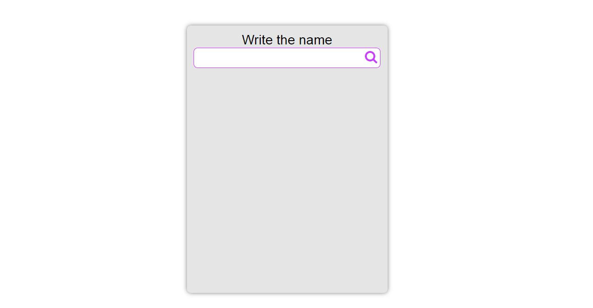

## Datalist Search Filter



This is a search filter that hints the user with available choices to make the filling input boxes easier. It's a bit more helpful than a regular input box depending on certain situation when you need more accessibility.

To view it click [here](https://sam0132nodier.github.io/search-filter-HTML_CSS).

Follow ```proprgrmmr``` [Instagram](https://www.instagram.com/proprgrmmr), [Twitter](https://www.twitter.com/proprgrmmr) and [Facebook](https://web.facebook.com/Pro.Programmer.14) :100:.